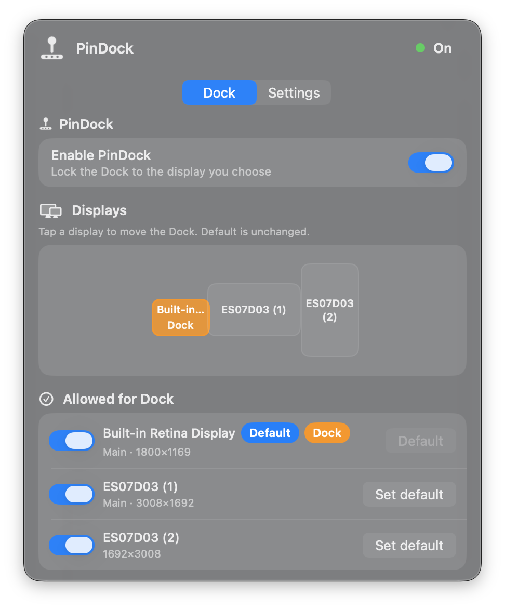
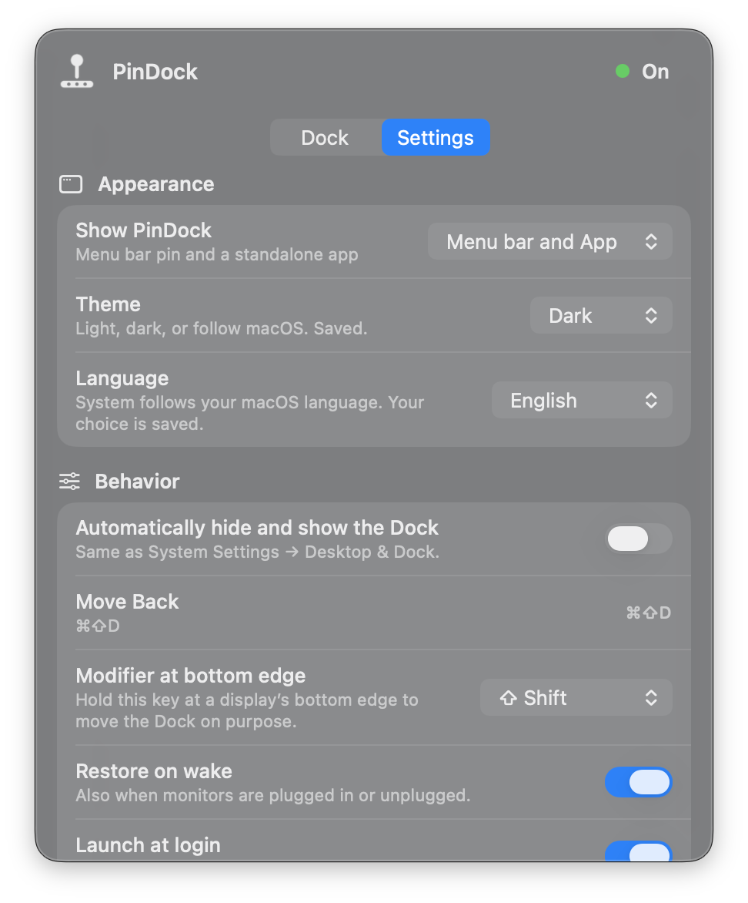
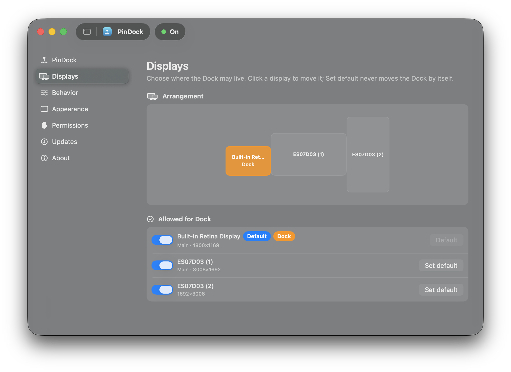
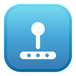

<p align="center">
  
</p>

<h1 align="center">PinDock</h1>

<p align="center">
  <strong>Pin the macOS Dock to the display you choose.</strong><br>
  No accidental jumps · free · offline · open source
</p>

<p align="center">
  <a href="https://github.com/j0b1t/PinDock/releases/latest"></a>
  <a href="https://github.com/j0b1t/PinDock/releases"></a>
  <a href="LICENSE"></a>
  
</p>

<p align="center">
  <a href="https://github.com/j0b1t/PinDock/releases/latest">⬇️ Download</a>
  &nbsp;·&nbsp;
  <a href="#features">✨ Features</a>
  &nbsp;·&nbsp;
  <a href="#install">🛠️ Install</a>
  &nbsp;·&nbsp;
  <a href="#support">☕ Support</a>
</p>

---

<p align="center">
  
</p>

<p align="center">
  <em>v1.1.0 menu bar · <strong>Dock</strong> tab — pin, display map, allow list</em>
</p>

<p align="center">
  
</p>

<p align="center">
  <em>Settings — Appearance (theme, language), Dock auto-hide, Move Back</em>
</p>

<p align="center">
  
</p>

<p align="center">
  <em>App window — sidebar, arrangement map, allowed displays</em>
</p>

---

## Why PinDock?

On multi‑monitor Macs the Dock **jumps** when the cursor grazes another screen’s edge.  
PinDock keeps it where **you** want it — quietly, with no account and no ads.

| | Goal | What you get |
|--|------|----------------|
| 🎯 | Stay focused | Dock stops hopping between screens |
| 👆 | Move on purpose | Hold **⇧ Shift** + bottom edge, or click a display |
| 🏠 | Home base | **Set as default** (status only) · **⌘⇧D** Move Back |
| 🔒 | Stay private | Offline by default · optional GitHub update check only |

---

<!-- Explicit ids so nav links work even with emoji in the title -->
<h2 id="features">✨ Features</h2>

- 🔒 **Lock** — soft‑blocks other displays so the Dock doesn’t jump  
- 🏠 **Default display** — *Set as default* never moves the Dock by itself  
- ⇧ **Shift + edge** — intentional native Dock moves  
- 🗺️ **Display map** — click a screen to move the Dock there  
- ↩️ **Move Back** — button or **⌘⇧D** to the default display  
- 🚫 **Block list** — forbid the Dock on specific screens  
- 💤 **Wake / plug** — optional restore to default  
- 🙈 **Dock auto-hide** — same on/off as System Settings → Desktop & Dock  
- 🎨 **Appearance** — menu bar, app window, or both. Theme (Light / Dark / System) and language live here too.  
- 📌 **Menu bar** — Control Center–style popover (click outside to dismiss)

---

<h2 id="install">🛠️ Install</h2>

### Download (recommended)

1. Download **`PinDock-x.y.z.zip`** from the [latest release](https://github.com/j0b1t/PinDock/releases/latest)  
2. Double‑click the zip → you get **PinDock.app**  
3. Drag **PinDock.app** into **Applications**  
4. Open PinDock  
5. **System Settings → Privacy & Security → Accessibility** → enable **PinDock**

#### ⚠️ If macOS says “Not Opened” / “Move to Bin”

Open source builds are **not** Apple‑notarized (no paid developer fee). That’s expected.

1. **Right‑click PinDock.app → Open → Open**  
2. Or **System Settings → Privacy & Security → Open Anyway**

### From source

```bash
git clone https://github.com/j0b1t/PinDock.git
cd PinDock
chmod +x Scripts/*.sh
./Scripts/install.sh
```

→ `/Applications/PinDock.app`

```bash
./Scripts/package_app.sh   # → PinDock.app
./Scripts/package_zip.sh   # → PinDock-x.y.z.zip  (for releases)
```

---

## 🚀 Usage

1. Click the **pin** in the menu bar  
2. **Set as default** on your home display  
3. Work as usual — the Dock stays put  
4. **⇧ Shift** + bottom edge of an allowed display to move it  
5. **⌘⇧D** or **Move Back** when you want it home  

Click outside the panel (or press Escape) to close it — just like Control Center.

---

<h2 id="support">☕ Support</h2>

Optional tips never unlock features — thank you if you do 💙

| | |
|--|--|
| ⚡ **Bitcoin Lightning** | [`j0b1t@strike.me`](https://strike.me/j0b1t) |
| ☕ **Ko‑fi** | [ko-fi.com/j0b1t](https://ko-fi.com/j0b1t) |

---

## 🧠 How it works

- Soft‑blocks the bottom edge of non‑host displays (unless the modifier is held)  
- Auto moves briefly use the target edge, then restore the cursor  
- Default display is remembered with a **stable fingerprint** (survives login / new display IDs)

Code lives under `Sources/PinDock/`.

---

## 📋 Requirements

- macOS **13+**  
- **Accessibility** permission  

---

## 🤝 Contributing

Issues for bugs are welcome (macOS version, layout, Dock side).  
PRs only if **explicitly invited**. See [CONTRIBUTING.md](CONTRIBUTING.md).

---

## 📄 License

[MIT](LICENSE) — free to use, study, and share.

---

<p align="center">
  <br>
  <sub>Made with care for multi‑monitor Macs · <a href="https://github.com/j0b1t/PinDock/releases/latest">⬇️ Download ZIP</a></sub>
</p>
